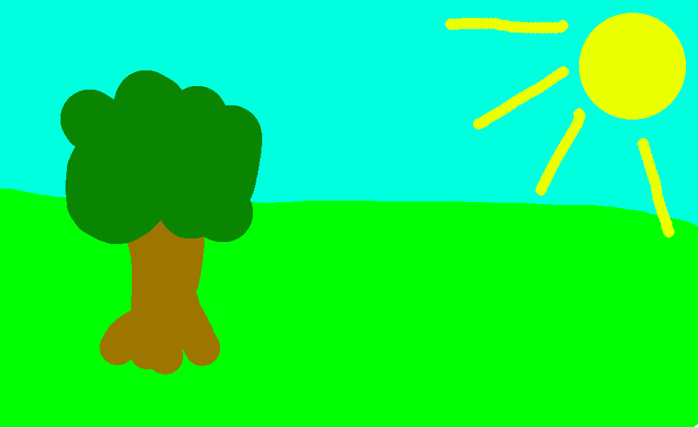

# 🖍️ Whiteboard Application

A fully interactive **Whiteboard Application** built using **C++**, **OpenGL**, and **CMake**, providing real-time drawing, smooth rendering, and a modern UI powered by ImGui.

---

## ✨ Features

- 🎨 **Real-time drawing** with OpenGL for smooth and responsive experience.  
- 🧩 **Design Patterns implemented**:
  - Singleton  
  - Facade  
  - ...
  - Command Pattern (for actions history)  
- 🔄 **Undo / Redo functionality**:
  - Implemented using **two separate stacks**:
    - **Undo Stack** → stores executed commands  
    - **Redo Stack** → stores reverted commands  
  - Keyboard shortcuts:
    - `Ctrl + Z` → Undo  
    - `Ctrl + Y` → Redo  
- 🖥️ **Modern User Interface** using **ImGui**  
- 💾 **Saving drawings** using OS kernel system calls for fast and direct file writing.  

---

## 🛠️ Used Technologies
- **C++**
- **OpenGL**
- **ImGui**
- **CMake** – for building and project configuration  

---

## 📚 Libraries Used
- **GLFW** – Window creation & input handling  
- **GLAD** – OpenGL function loader  
- **GLM** – Math library for graphics (vectors, matrices)  
- **stb_image** – Image loading  
- **ImGui** – GUI framework  

---

## 🖼️ Screenshots

### Main Interface

### Saving image

### Saved image

---

## 🚀 Project Goal
Create a lightweight, fast, and extensible drawing application that demonstrates:
- C++ design principles  
- Graphics programming  
- UI integration  
- Real-time interaction handling  

---

## 📌 Status
Currently under active development. More features like shapes, color picker, and export formats will be added soon.